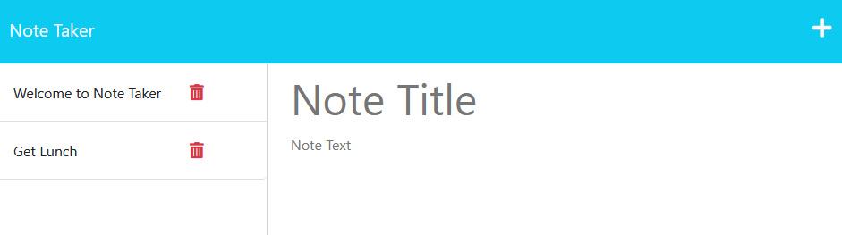
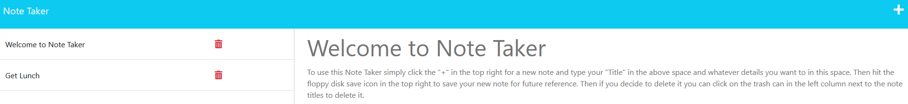

# Note_Taker_MVR11bc

## Express.js Challenge: Note Taker

This repository is used to generate a webpage that you can write and save Notes or make a To Do List with the ability to review them and delete them when they are no longer relevant.
 

## Usage

In order to use the application go to:
[Deployed application](https://aqueous-lowlands-26468.herokuapp.com/notes)
To use this Note Taker simply click the "+" in the top right for a new note and type your "Title" in the above space and whatever details you want to in this space. Then hit the floppy disk save icon in the top right to save your new note for future reference. Then if you decide to delete it you can click on the trash can in the left column next to the note titles to delete it. 

## Contributors

Consulting and guidance used in creation of this repository include peers and resources (in no order) as follows:

- Daniel Cohen
- Brian Hamlin
- Andres Long

## License

[MIT License](./LICENSE)
